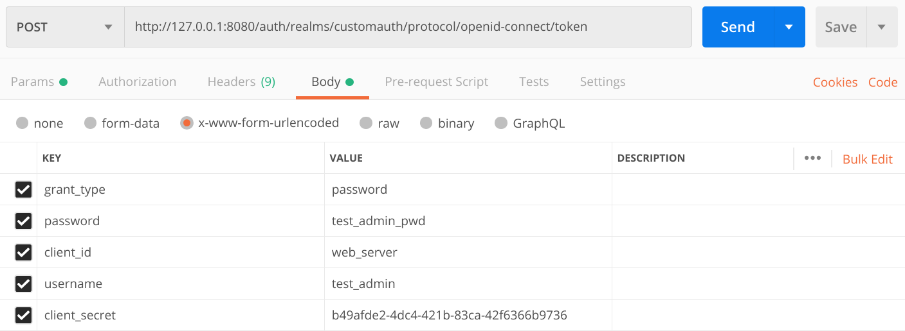

# Authentification Web : Usage d'un IAM (Identity Access Management) tiers KeyCloak

## 1. Preambule

La gestion de l'authentification et des autorisations dans une application est très rapidement complexe au vu des exigences à repecter.
Une alternative peut être réalisée en déléguant cette partie un service tiers, qui garantira l'ajout d'utilisateurs, le stockage des informations sécurisées, la gestion de droits.
Les Identity Access Management, IAM, font partis de ces systèmes. [Keycloak](https://www.keycloak.org/) est un outil open source permettant de mettre en oeuvre cette famille de services.

## 2.  Outils mis à disposition
- Serveur Web Flask
- Outil Postman
- Un exemple de serveur Web Flask (ajout d'utilisateur, endpoints a compléter)
- Une procédure de mise en oeuvre d'un service Keycloak (Docker)

## 3.  Connaitre les éléments principaux de Keycloak

Afin de comprendre les premières étapes de configuration d'un server keycloak, suiver les "basics tutorials" ici https://www.katacoda.com/keycloak.

## 4. Configuration d'un container keycloak

A l'aide de ```docker``` nous allons déployer une instance de serveur Keycloak.

Nous allons récupérer l'image ```jboss/keycloak``` et la configurer (voir https://hub.docker.com/r/jboss/keycloak/)

### 4.1 Démarrage de l'instance Keycloak

La commande suivante va démarrer une instance Keycloak dans un container docker. Si l'image ```jboss/keycloak``` n'est pas présente sur la machine hote, docker va automatiquement la téléchargée.

```
docker run --name keycloak -p 8080:8080 -e DB_VENDOR=H2 -e KEYCLOAK_USER=tp -e KEYCLOAK_PASSWORD=tp -e DB_ADDR=127.0.0.1 jboss/keycloak
```
- Explications

    - ```--name keycloak``` va associer le nom ```keycloak``` à l'instance docker créé. Nous pourrons ainsi réutiliser ce nom d'instance pour démarrer ou arréter cette dernière
    - ```-p 8080:8080``` va rédiriger les ports ```8080``` du container vers les ports```8080``` de la machine hote
    - ```-e DB_VENDOR=H2``` définition d'un variable d'environnement qui va préciser le type de base de données utilisée pour stoquer les informations. Ici une base de données embarquées H2
    - ```-e KEYCLOAK_USER=tp -e KEYCLOAK_PASSWORD=tp``` définition des variables d'environnement qui précise le username et pwd de l'administrateur de Keycloak
    - ```-e DB_ADDR=127.0.0.1```  définition d'un variable d'environnement qui va préciser l'adresse IP de la base de données utilisées par Keycloak
    - ```jboss/keycloak``` nom de l'image docker utilisée

### 4.2 Configuration Basique de l'instance Keycloak
- Créer un nouveau ```Realm``` de dénomination ```customauth```.
- Ajouter un nouvel utilisateur à ```customauth```
    - Username: ```test_tp ```
    - Password: ``` test_tp_pwd ```
- Vérifier s'il est possible de récupérer un token d'authentification valide de Keycloak pour l'utilisateur créé:
    ```
    curl -X POST http://127.0.0.1:8080/auth/realms/customauth/protocol/openid-connect/token -H 'content-type: application/x-www-form-urlencoded' -d 'username=test_tp&password=test_tp_pwd&grant_type=password&client_id=admin-cli'
    ```
    - résultat attendu:
    ```JSON
    {"access_token":"eyJhbGciOiJSUzI1NiIsInR5c...","expires_in":300,"refresh_expires_in":1800,"refresh_token":"eyJhbGciOiJIUzI1Ni...","token_type":"bearer","not-before-policy":0,"session_state":"2efc40d7-415a-4d52-8180-1db55040d974","scope":"email profile"}
    ```
- Changer le password dans la ligne de vérification précédente (```...password=test_tp_fake...```) et vérifié que l'utilisateur est bien rejeté.
    - résultat attendu:

    ```JSON
    {"error":"invalid_grant","error_description":"Invalid user credentials"}
    ```
### 4.3 Configuration d'un admin remote pour Keycloak

#### 4.3.1  Préambule
Soyez sur d'avoir suivit le tutorial keycloak https://www.katacoda.com/keycloak et d'avoir ajouté un ```realm``` --> ```customauth```


#### 4.3.2 Ajout d'un client
- Assurez vous que votre ```Realm``` soit bien sélectionné
- Selectionner le menu ``` Clients```
- Cliquer sur le bouton ```Create```
    - Ajouter le nom de votre client ```web_server```
    - Mettre le **Client Protocol** à ```openid-connect```
    - Cliquer sur le bouton ```Save```
    - Setter le champ ```Valid Redirect URIs``` avec votre URL de redirection e.g ```http://127.0.0.1:5000/*```
    - Setter le champ ```Access Type ``` à la valeur```Confidential```
    - Ouvrir l'onglet ```Credential``` et copier le ```Secret``` de votre client dans votre fichier de configuration (e.g CLIENT_SECRET into local.settings.py).
    
#### 4.3.2 Ajout d'un utilisateur admin
- Selectionner votre ```Realm```
- Ajouter un utilisateur login: ```test_admin```
- Ajouter un  credential NOT TEMPORARY  pwd: ```test_admin_pwd```
- Selectionner l'onglet  ```Role Mappings```
    - Dans la ComboBox ```Client Roles``` sélectionner ```realm-management```
    - Selectionner tous les roles disponible et les assigner à l'utilisateur
    
#### 4.3.2 Vérification du token d'Admin Token
- Vérifier le bon fonctionnement de votre configuration en demandant un token admin

```
curl -X POST http://127.0.0.1:8080/auth/realms/customauth/protocol/openid-connect/token -H 'content-type: application/x-www-form-urlencoded' -d 'username=test_admin&password=test_admin_pwd&grant_type=password&client_id=web_server&client_secret=<your generated client secret>'
```
- Résultat attendu:

```JSON
{"access_token":"eyJhbGciOiJSUz...","expires_in":300,"refresh_expires_in":1800,"refresh_token":"eyJhbGciOiJIUz...","token_type":"bearer","not-before-policy":0,"session_state":"90aa87a7-71b1-4605-99e3-47ff9145e254","scope":"email profile"}
```

- Vous pouvez également utiliser une requète Postman pour vérifier l'accès à ce token


 

## 5. Mise à jour du server Flask
Une fois le serveur Keycloak configuré, nous allons modifier le serveur Flask afin qu'il délègue la gestion d'authentification à KeyCloak.

### 5.1 Configuration du serveur Flask
- Le fichier ```local_settings.py``` contient les informations nécessaires pour se connecter au serveur Keycloak

```Python
# for local
SECRET_KEY = b'SomethingNotEntirelySecret'
SERVER_URL = "http://127.0.0.1:8080/auth/"
ADMIN_USERNAME = "test_admin"
ADMIN_PASS = "test_admin_pwd"
REALM_NAME = "customauth"
CLIENT_ID = "web_server"
CLIENT_SECRET = "b49afde2-4dc4-421b-83ca-42f6366b9736"
INGRESS_HOST = ""
```
- Explications :

    - ```SECRET_KEY```: uniquement utiliser pour le server Flask
    - ```SERVER_URL```: url du server keycloak
    - ```ADMIN_USERNAME```: username de l'utilisateur admin du realm courant
    - ```ADMIN_PASS```: password de l'utilisateur admin du realm courant
    - ```REALM_NAME```: nom du realm courant 
    - ```CLIENT_ID```: id du client utilisé pour effectuer les requètes vers le serveur keycloak
    - ```CLIENT_SECRET```: secret du client courant
    
- Afin que ce fichier de configuration soit pris en compte par notre server Flask executer la commande ci-dessous:
    ```
    $ export KEYCLOAK_FLASK_SETTINGS=local_settings.py

    ```
    

- La commande suivante permet de charger la configuration ```local_settings.py``` au démarrage du serveur flask (fichier ```app.py```)
```python
    #Load all information for keycloak
    app.config.from_envvar('KEYCLOAK_FLASK_SETTINGS')
```

### 5.2 Utilisation d'utiliaires python pour l'intégration Keycloak-Flask

Une libraire permet d'interagir facilement entre python et Keycloak https://pypi.org/project/python-keycloak/.
Nous utilisons cette librairie au travers du fichier ```tools/keycloak_utils.py``` qui va proposer des fonctions d'interactions avec Keycloak.

- ```def get_oidc():```: permet de configurer un client capable d'interagir avec Keycloak
- ```def get_token(oidc_obj, username, password):```: permet de demander un token d'un utilisateur (username, password) à Keycloak par l'intermédiaire d'un client (```oidc_obj --> get_oidc()```)
- ```def get_token(oidc_obj, username, password):```
- ```def check_token(access_token):```: permet de vérifier la validité d'un token (```access_token```) par l'intermédiaire d'un client.
- ```def get_userinfo(access_token):```: permet de récupérer des informations relatives à un utilisateur via son token (```access_token```) par l'intermédiaire d'un client.
- ```def get_admin():``` : permet de configuer un client en admin
- ```def create_user(admin, username, email, password):```: permet d'ajouter un utilisateur dans le server keycloak

### 5.3 Modification du serveur Flask pour l'interaction avec Keycloak

### 5.3.1 Objectif

Créer des nouveaux points d'entrées sur le serveur flask permettant:
- Logger un utilisateur (via keycloak):
    - format attendu:
        - URL: ```http://127.0.0.1:5000/authkeycloak/login```
        - METHOD: ```POST```
        - BODY:
        - Type: ```JSON```
        - Value:
            ```JSON
            {
	            "username":"userABC",
	            "password":"userABC"
            }
            ```
- Vérifier le token d'un utilisateur enregistré dans un cookie (via keycloak):
    - format attendu:
        - URL: ```http://127.0.0.1:5000/authkeycloak/checktoken```
        - METHOD: ```POST```

- D'ajouter un utilisateur (via keycloak):
    - format attendu:
        - URL: ```http://127.0.0.1:5000/authkeycloak/users```
        - METHOD: ```POST```
        - BODY:
        - Type: ```JSON```
        - Value:
            ```JSON
            {
	            "username":"userABC2",
	            "password":"userABC2",
	            "email":"user@ABC2.com"
            }
            ```

### 5.3.2 Tips
 - Les modifications devront être réalisées dans le fichier ```./route/authKeyCloak.py``` :
    - Logger un utilisateur --> dans la méthode ```def login():```
    - Vérifier le token d'un utilisateur --> dans la méthode ```def checkToken():```
    - Ajouter un utilisateur --> dans la méthode ```def addUser():```

 - Vous pouvez récupérer le contenu du body de la requète http dans Flask à l'aide ```request.get_json()```
    ```python
    body = request.get_json()
    print(str(body["username"]))

    ```
 - Utiliser les tools contenus dans  ```tools/keycloak_utils.py``` pour compléter vos méthodes